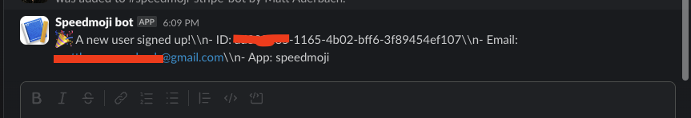

# Supabase Auth Slackbot
Tutorial to get alerts in Slack when new users signup with Supabase Auth



## Setup a Slack app

1. Create the Slack app -> https://api.slack.com/apps
2. Within this app, click Incoming Webhooks and enable it. Add it to a channel and keep the webhook URL handy

## Configure an auth trigger in Supabase

When using Supabase Auth, you can setup triggers to take actions when new users are created. Triggers to the Auth.users table must be created via a SQL query (not in the UI). 

1. First, add a function called `notify_new_signup`

```
CREATE OR REPLACE FUNCTION public.notify_new_signup()
RETURNS trigger
LANGUAGE plpgsql
SECURITY DEFINER
AS $function$
DECLARE
  request_id BIGINT;
BEGIN
  -- Log the trigger firing
  RAISE LOG 'notify_slack trigger fired for table: %', TG_TABLE_NAME;

  -- Send the message using net.http_post with proper Slack payload
  request_id := net.http_post(
    url := 'YOUR_SLACK_WEBHOOK',
    body := jsonb_build_object(
      'text', '🎉 A new user signed up!\\n' ||
              '- ID: ' || NEW.id || '\\n' ||
              '- Email: ' || NEW.email || '\\n' ||
              '- App: APP_NAME'
    ),
    headers := jsonb_build_object('Content-Type', 'application/json')
  );

  -- Log the request ID
  RAISE LOG 'HTTP POST request sent with request_id: %', request_id;

  RETURN NEW; -- Required for triggers
END;
$function$;
```
Replace `YOUR_SLACK_WEBHOOK` with your slack webhook and put an app name string in `APP_NAME`

You run the above sql command in the Supabase SQL Editor 

2. Setup a trigger to call this function

```
CREATE TRIGGER notify_new_signup_trigger
AFTER INSERT ON auth.users
FOR EACH ROW
EXECUTE FUNCTION public.notify_new_signup();
```

Run this SQL command in the same sql editor. 

3. Enable the pg_net extension. Click the Database tab -> Extensions -> Search for pg_net and enable it on the extensions schema.

[Docs on pg_net](https://supabase.com/docs/guides/database/extensions/pg_net)

Test it! It should work!!

## Debugging 

You should see logs in the Supabase log tag under the Postgres collection. 


